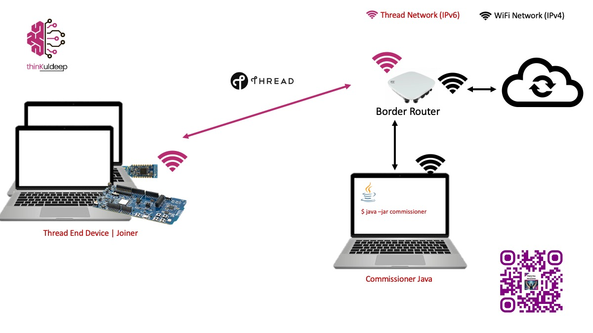

# OpenThread Commissioner Implementation in Java

This project provides a reference implementation of an external OpenThread Commissioner in Java. [OpenThread’s open-source project](https://github.com/openthread/ot-commissioner) 
currently offers a native [Commissioner CLI](https://openthread.io/guides/commissioner/build.md) and an 
[Android app](https://github.com/openthread/ot-commissioner/tree/main/android) for external commissioning, 
but no standalone Java-based implementation.

This project aims to bridge that gap by providing a step-by-step guide for developers to build an external Commissioner 
in Java. We encourage community contributions to refine and enhance this implementation, with the goal of submitting 
a PR to the [official OpenThread repository](https://github.com/openthread/ot-commissioner). See [this guide](contributing.md) on how to contribute.

---

## Overview

This implementation is based on the [Android Commissioner](https://github.com/openthread/ot-commissioner/tree/main/android) from OpenThread but replicates its behavior in a plain Java application. It builds a native Java library from the OpenThread Commissioner repository and integrates it into a Java application.


---

## Pre-Built Libraries
The following are the pre-built libraries for the Java Commissioner if one don't want to build it from scratch:

- **[libotcommissioner.jar](pre-built/libotcommissioner.jar)** – Cross-platform Java JNI wrapper 
- **[libcommissioner-java-mac-amd_64.jnilib](pre-built/libcommissioner-java-mac-amd_64.jnilib)** – For macOS with Apple Silicon
- **[libcommissioner-java-mac-x86_64.jnilib](pre-built/libcommissioner-java-mac-x86_64.jnilib)** – For macOS with Intel chips
- **[libcommissioner-java-ubuntu-x86_64.so](pre-built/libcommissioner-java-ubuntu-x86_64.so)** – For Ubuntu Linux x86_64
- **[openthread-commissioner-java-1.0-SNAPSHOT-jar-with-dependencies.jar](pre-built/openthread-commissioner-java-1.0-SNAPSHOT-jar-with-dependencies.jar)** - This project's delivery jar with cross-platform dependencies

Rename the respective library to `libcommissioner-java.jnilib or libcommissioner-java.so` and place it in the same directory as your java application. Embed `libotcommissioner.jar` in your application jar, above jar `openthread-commissioner-java-1.0-SNAPSHOT-jar-with-dependencies.jar` already package it..

---

## Building the Native Commissioner
It is recommended to build your native Commissioner libraries to ensure compatibility with your platform. Follow the steps below to build the native Commissioner: 
### Prerequisites
Ensure that the `JAVA_HOME` environment variable is set correctly to allow JNI to locate Java.

Example output:
```
echo $JAVA_HOME
/Users/ksingh/Library/Java/JavaVirtualMachines/openjdk-23.0.1/Contents/Home
```
### Build Process

Run the provided script to build the native Commissioner libraries:

```sh
./build-libs.sh
```

This will generate the following libraries under the `libs/` directory:

- `libotcommissioner.jar`
- `libcommissioner-java.jnilib` (or `libcommissioner-java.so` depending on the platform)

---

## Building and Running the Java Commissioner

### Build

Compile and package the Java Commissioner using Maven:

```sh
mvn clean package
```

This will create a JAR file with dependencies:

```
target/openthread-commissioner-java-1.0-SNAPSHOT-jar-with-dependencies.jar
```

### Run

Navigate to the `target/` directory and execute the Commissioner with `-Djava.library.path=.` in current directory:

```sh
cd target  
java -Djava.library.path=. -jar openthread-commissioner-java-1.0-SNAPSHOT-jar-with-dependencies.jar  
```

Expected output:

```
INFO  c.thread.commissioner.OTBRDiscoverer - Discovering Border Router at _meshcop._udp.local.
INFO  com.thread.commissioner.Runner - Discovering Border Router...1
INFO  com.thread.commissioner.Runner - Discovering Border Router...2
INFO  com.thread.commissioner.Runner - Discovering Border Router...3
INFO  c.thread.commissioner.OTBRDiscoverer - Service resolved: 172.20.10.9:49154 OpenThreadDemo 1111111122222222
>>> Enter PSKc (leave blank to compute): 445f2b5ca6f2a93a55ce570a70efeecb
Commands:
1. Check State
2. Enable All Joiners
3. Exit
Enter command number: 1
INFO  com.thread.commissioner.Runner - Commissioner connected successfully!
INFO  com.thread.commissioner.Runner - State: kActive
```

If the Border Router is not discovered automatically, you can manually specify its IP and port. If PSKc is not provided, the application will prompt for the network name, extended PAN ID, and passphrase to generate it.

---

## Enable Joiners to Join the Network

Add Joiner Rule by choosing the command 2, it will enable all joiner for a Pre-Shared Key for Device (PSKD):

```
Commands:
1. Check State
2. Enable All Joiners
3. Exit
Enter command number: 2
Enter PSKd For All Joiner:JO1NME
INFO  c.t.commissioner.ThreadCommissioner - enableAllJoiners - steeringData=ffffffffffffffffffffffffffffffff A joiner (ID=af5570f5a1810b7a)
2025-03-09 22:00:30 INFO  com.thread.commissioner.Runner - All Joiners are accepted at PSKD:JO1NME
```

---
## Joining from a Device

To test device joining, [build and flash a Thread end-device firmware](https://medium.com/iotpractices/connecting-thread-devices-to-internet-f80c870c014a) with commissioning support. The device should discover the network and attempt to join using the Pre-Shared Key for Device (PSKD).

On a successful join attempt, the Commissioner logs will display:

```
INFO  c.t.commissioner.ThreadCommissioner - A joiner (ID=ca666d7873988c66) is requesting commissioning  
INFO  c.t.commissioner.ThreadCommissioner - A joiner (ID=ca666d7873988c66) is connected with OK  
INFO  c.t.commissioner.ThreadCommissioner - A joiner (ID=ca666d7873988c66) is finalizing  
```
---

## Disclaimer

This project is a **proof of concept** and is **not recommended for production use at this stage**. It serves as a reference implementation for Java-based external commissioning.

---

## Contribute

We welcome contributions from the community to improve and expand this project. Our goal is to refine it to a level where it can be submitted as a PR to the official [OpenThread repository](https://github.com/openthread/ot-commissioner). Please refer to OpenThread’s [contribution guidelines](contributing.md) to get started.

## References
- [Connecting Thread devices to Internet](https://medium.com/iotpractices/connecting-thread-devices-to-internet-f80c870c014a)
- [Understanding Commissioner and Joiner](https://medium.com/iotpractices/simplifying-thread-network-provisioning-with-joiner-and-commissioner-roles-60c624f0de85)
- [Understanding External Commissioning - Commissioner CLI](https://medium.com/iotpractices/external-commissioning-in-thread-network-b06e7b8a64ab)
- [Understanding External Commissioning - Android App](https://medium.com/iotpractices/building-and-using-openthread-commissioner-mobile-app-03bde78773ab)
- [Understanding External Commissioning - Java Application](https://medium.com/iotpractices/openthread-commissioner-implementation-in-java-c63c689a2af6)